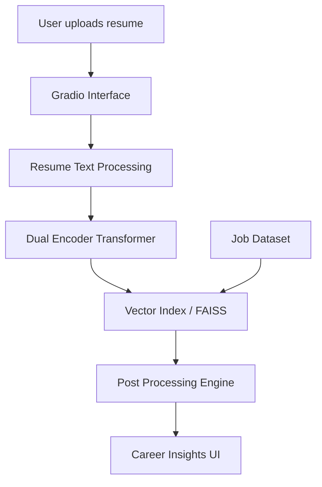

# SkillSpace

SkillSpace is a semantic resume-to-job matching project that uses compact embedding models, FAISS retrieval, and deterministic skill-gap reasoning to produce explainable career-match outputs.

Phase 1 is intentionally scoped as a deployable vertical slice rather than a from-scratch transformer research project.

---

## Vision

Modern hiring pipelines rely heavily on keyword heuristics and static rule-based systems. SkillSpace explores a learning-based approach where:

- resumes are represented as semantic embeddings
- jobs are represented in the same vector space
- similarity reasoning replaces keyword matching

The goal is to build a **career intelligence engine** rather than a simple resume matcher.

---

## Core Idea

SkillSpace maps resumes and jobs into a shared embedding space, retrieves relevant roles semantically, and explains the result with lightweight skill-gap reasoning.

Phase 1 uses a public encoder model:

- `sentence-transformers/all-MiniLM-L6-v2`

---

## 🏗️ System Overview



---

## Phase 1 Features

- Semantic job matching
- Skill gap recommendations
- Hugging Face dataset ingestion
- Retrieval evaluation with Recall@K / MRR
- Gradio demo with sample and HF runtime modes

---

## Current Stack

- PyTorch
- Sentence Transformers
- FAISS
- Hugging Face Datasets / Models / Spaces
- Gradio

---
## 🗺️ Planning Docs

- [Feasibility Assessment](docs/feasibility-assessment.md)
- [Phase 1 Implementation Plan](docs/phase-1-implementation-plan.md)
- [Phase 2 Implementation Plan](docs/phase-2-implementation-plan.md)

---

## Project Status

Current state:

- public HF datasets downloaded and normalized
- job embeddings generated with a compact encoder
- FAISS retrieval working
- Gradio app working in `sample` and `hf` modes
- evaluation script added
- public Hugging Face Space live

Current artifacts:

- processed jobs: `artifacts/processed/jobs_hf_v1.parquet`
- processed resumes: `artifacts/processed/resumes_hf_v1.parquet`
- embeddings: `artifacts/embeddings/jobs_hf_v1.npy`
- FAISS index: `artifacts/index/jobs_hf_v1.faiss`

Live links:

- Demo Space: [greatvivek11/skillspace-demo](https://huggingface.co/spaces/greatvivek11/skillspace-demo)
- Dataset repo: [greatvivek11/skillspace-data](https://huggingface.co/datasets/greatvivek11/skillspace-data)
- Model repo: [greatvivek11/skillspace-encoder](https://huggingface.co/greatvivek11/skillspace-encoder)

---

## Local Run

Install dependencies:

```bash
python3 -m pip install -r requirements.txt
```

Run the app:

```bash
export SKILLSPACE_HF_LOCAL_ONLY=1
python3 -m src.ui.app
```

If HF artifacts are present, the app now defaults to `hf` mode automatically. Otherwise it falls back to `sample`.

## Hugging Face Space Prep

Recommended publishing split:

- Space repo: Gradio app and lightweight runtime code
- Model repo: fine-tuned embedding model
- Dataset repo: cleaned SkillSpace dataset artifacts

Space-specific notes:

- root entrypoint: [app.py](/Users/vivekkaushik/Projects/skillspace/app.py)
- Space dependencies: [requirements-space.txt](/Users/vivekkaushik/Projects/skillspace/requirements-space.txt)
- offline-friendly local cache mode supported via `SKILLSPACE_HF_LOCAL_ONLY=1`
- HF runtime prefers prebuilt index artifacts automatically when available

## Portfolio Positioning

This Phase 1 release is best framed as:

- a semantic candidate-to-role matching demo
- an explainable retrieval system for recruiters and hiring managers
- a deployable ML product slice rather than a pure research prototype

## Motivation

SkillSpace is built to explore how modern representation learning can reshape career intelligence systems.

The project aims to demonstrate practical ML system design, retrieval engineering, and product thinking in a portfolio-friendly form.
