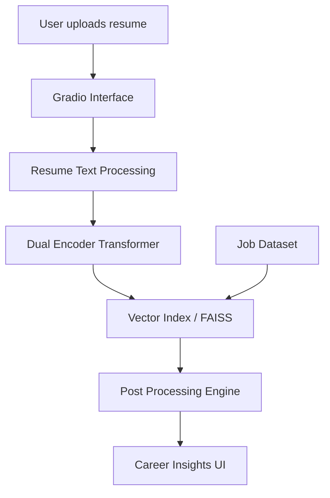

# SkillSpace — Neural Career Intelligence Engine

SkillSpace is a deep learning system that understands resumes and job descriptions in a shared semantic space to provide career insights, job matching, and skill gap analysis.

This project demonstrates end-to-end machine learning engineering — from training a transformer model **from scratch** to deploying an interactive inference product.

---

## 🚀 Vision

Modern hiring pipelines rely heavily on keyword heuristics and static rule-based systems. SkillSpace explores a learning-based approach where:

- resumes are represented as semantic embeddings
- jobs are represented in the same vector space
- similarity reasoning replaces keyword matching

The goal is to build a **career intelligence engine** rather than a simple resume matcher.

---

## 🧠 Core Idea

SkillSpace trains a **tiny dual-encoder transformer** from scratch that learns relationships between:

- skills
- experience narratives
- job descriptions
- career archetypes

This enables:

- semantic job retrieval
- skill gap detection
- career trajectory clustering
- interpretable ML outputs

---

## 🏗️ System Overview

---

## ✨ Key Features (Planned)

- Neural resume understanding
- Semantic job matching
- Skill radar visualization
- Career cluster prediction
- Skill gap recommendations
- Embedding space visualization

---

## 🔬 Research & Engineering Goals

This project focuses on:

- Training transformers from scratch
- Contrastive representation learning
- Neural information retrieval
- Vector search infrastructure
- ML system design
- Explainable AI interfaces

---

## ⚙️ Tech Stack

- PyTorch
- Custom Transformer Architecture
- FAISS / Vector Retrieval
- HuggingFace (model hosting + inference)
- Gradio (interactive UI)

---

## 🗺️ Planning Docs

- [Feasibility Assessment](docs/feasibility-assessment.md)
- [Phase 1 Implementation Plan](docs/phase-1-implementation-plan.md)
- [Phase 2 Implementation Plan](docs/phase-2-implementation-plan.md)

---

## 📌 Project Status

Currently in **architecture & data design phase**.

Upcoming milestones:

- tokenizer training
- dataset construction
- pretraining dual encoder
- retrieval fine-tuning
- UI deployment

---

## 📖 Motivation

SkillSpace is built to explore how modern representation learning can reshape career intelligence systems.

The project aims to demonstrate **practical deep learning engineering** rather than incremental model fine-tuning.

---

## 🤝 Contribution

This is currently a personal research & engineering project. Documentation and reproducibility will improve as development progresses.
