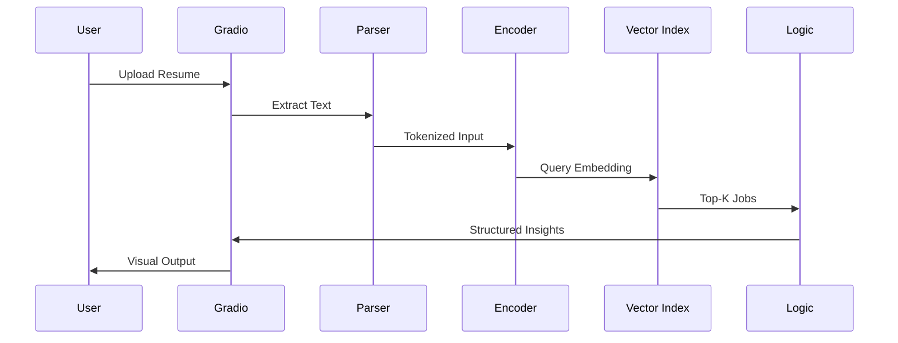
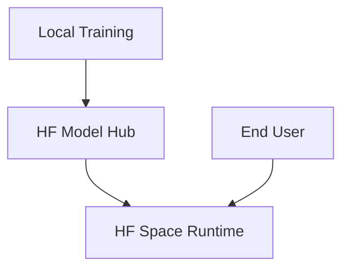

# SkillSpace Architecture

## Overview

SkillSpace is designed as a **neural career intelligence system** that learns semantic relationships between resumes and job descriptions using a dual‑encoder transformer architecture. The system focuses on deep learning representation learning rather than rule‑based matching.

The architecture prioritizes:

- semantic reasoning over keyword heuristics
- end‑to‑end ML system design
- modular training and inference components
- lightweight deployment on HuggingFace Spaces

---

## High Level System Architecture

```mermaid
flowchart LR

User[User Resume Upload]
UI[Gradio UI Layer]
Parser[Resume Parsing & Cleaning]
Encoder[Dual Encoder Transformer]
EmbedIndex[Vector Index (FAISS)]
Jobs[(Job Dataset)]
Post[Post‑processing Logic]
Viz[Insight Visualization]

User --> UI
UI --> Parser
Parser --> Encoder
Encoder --> EmbedIndex
Jobs --> EmbedIndex
EmbedIndex --> Post
Post --> Viz
Viz --> UI
```

---

## Component Breakdown

### 1. UI Layer (Gradio)
- Provides interactive interface for resume upload
- Displays semantic job matches and career insights
- Renders visualizations (skill radar, embedding projections)

### 2. Resume Parsing
- Extracts raw text from uploaded resume
- Cleans formatting artifacts
- Normalizes domain‑specific vocabulary

### 3. Neural Encoder
- Tiny transformer trained from scratch
- Shared weights for resume and job inputs
- Outputs dense semantic embeddings

### 4. Vector Retrieval Layer
- FAISS index stores job embeddings
- Performs nearest neighbor search in embedding space
- Enables semantic job retrieval

### 5. Post‑processing Engine
- Skill inference
- Career cluster prediction
- Skill gap estimation
- Confidence scoring

### 6. Visualization Layer
- Converts structured outputs into interpretable UI elements
- Embedding projections (2D)
- Skill radar charts
- Ranked job lists

---

## Data Flow



---

## Transformer Architecture Options Considered

| Architecture | Pros | Cons | Decision |
|--------|------|------|---------|
| Decoder‑only (GPT‑style) | Strong generative capability | Hard to train small models, unstable training, high compute | Rejected |
| Encoder‑Decoder | Flexible seq2seq learning | Overkill for retrieval tasks | Rejected |
| Vanilla BERT Classifier | Simple training setup | Limited retrieval capability | Rejected |
| Sentence Transformer (fine‑tuned) | Fast implementation | Weak learning signal for "from scratch" goal | Rejected |
| CNN / Hybrid Architectures | Experimental flexibility | Not standard for semantic retrieval | Rejected |
| **Dual Encoder Transformer (BERT‑style)** | Scalable retrieval, contrastive learning friendly, production relevant | Requires careful dataset construction | **Selected** |

---

## Why Dual Encoder Transformer

The dual encoder architecture was selected due to:

### 1. Retrieval Alignment
Modern search and recommendation systems rely on shared embedding spaces.

### 2. Training Stability
Encoder‑only transformers converge more reliably at smaller parameter scales.

### 3. Production Relevance
This architecture mirrors real‑world semantic search systems used in hiring platforms.

### 4. Computational Efficiency
Independent encoding of resumes and jobs enables pre‑computed embeddings.

### 5. Modular Scaling
Vector databases and retrieval layers can be swapped without retraining model logic.

---

## Model Architecture Summary

- Layers: 6
- Hidden Dimension: ~384
- Attention Heads: 6
- Parameters: ~30–40M
- Tokenizer: Custom BPE

This configuration balances:

- trainability on consumer hardware
- deployment feasibility on CPU
- sufficient semantic capacity

---

## Deployment Architecture



Deployment strategy emphasizes simplicity:

- training performed locally
- inference hosted on HF Spaces
- vector index stored alongside app

---

## Design Philosophy

SkillSpace prioritizes:

- representation learning over generation
- semantic reasoning over heuristics
- system clarity over infrastructure complexity

The architecture is intentionally minimal yet aligned with modern ML production paradigms.
